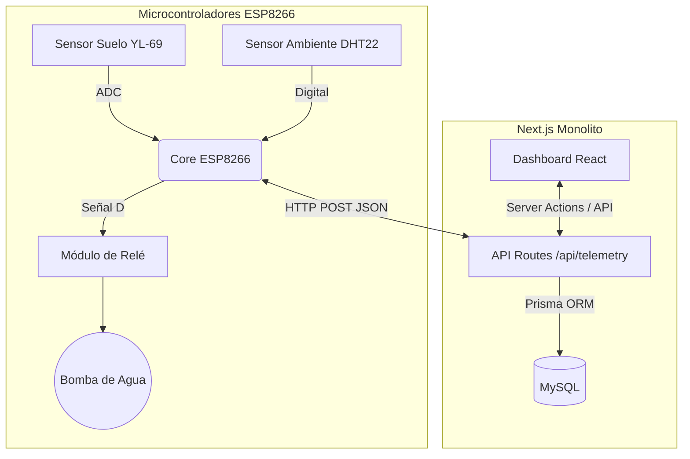

# FloraSense - Smart Irrigation IoT (Versión Simplificada) 🌿💧


**FloraSense** es una plataforma para la monitorización ambiental y el control de sistemas de riego. Conecta microcontroladores físicos con una interfaz web en tiempo real utilizando Next.js API Routes y MySQL.

Esta **versión simplificada** utiliza una arquitectura de monolito Next.js y comunicación HTTP directa con el ESP8266, eliminando la complejidad de MQTT y microservicios.

---

## ✨ Características Principales

*   **Telemetría Inteligente:** Monitorización de temperatura, humedad del aire y nivel de humedad del suelo vía HTTP.
*   **Control Remoto de Riego:** Sistema de riego manual desde el dashboard web con almacenamiento de estado en MySQL.
*   **Arquitectura Simplificada:** Un único proyecto Next.js (`apps/web`) maneja tanto la interfaz gráfica (React) como los endpoints API.
*   **Despliegue Contenerizado:** Infraestructura "plug-and-play" orquestada 100% con Docker Compose (Base de datos MySQL y la aplicación Web Node.js).

---

## 🏗️ Arquitectura del Sistema (Simplificada)



---

## 📂 Estructura del Repositorio

El proyecto está estructurado de la siguiente forma:

```text
FloraSense-IoT/
├── apps/
│   └── web/                # Aplicación Web (Next.js 14, TailwindCSS, Recharts, Prisma)
│       └── prisma/         # Esquema de base de datos MySQL (`schema.prisma`)
├── firmware/
│   ├── esp8266_florasense/ # Código fuente nativo (C/C++) para hardware real ESP8266
│   └── simulator/          # Hardware simulado en NodeJS
├── docker-compose.yml      # Definición de contenedores (MySQL y Web)
└── conexiones_cables.md    # Esquema y diagrama de conexión de hardware
```

---

## 🚀 Entorno de Desarrollo Local

### Prerrequisitos
*   [Docker](https://www.docker.com/) y Docker Compose instalados.

### Inicialización Rápida (Quickstart)

1.  **Clonar el repositorio:**
    ```bash
    git clone https://github.com/stxtiz/FloraSense-Simplificado.git
    cd FloraSense-Simplificado
    ```

2.  **Levantar la Infraestructura:**
    Con Docker Compose se levanta MySQL y se compila el servidor Next.js automáticamente:
    ```bash
    docker-compose up --build
    ```
    > El panel web y la API estarán disponibles en `http://localhost:3000`.

---

## 🛠️ Lista de Materiales de Hardware (BOM)

| Componente | Función Principal | Cantidad |
| :--- | :--- | :---: |
| **ESP8266 NodeMCU** | Cerebro con conectividad WiFi 2.4GHz nativa. | 1 |
| **DHT22 / AM2302** | Termohigrómetro de precisión para el ambiente. | 1 |
| **YL-69 + YL-38** | Sonda resistiva/capacitiva anticorrosión para suelo. | 1 |
| **Módulo Relé (5V)** | Interruptor electromagnético para control de la bomba. | 1 |
| **Micro-bomba sumergible** | Actuador hidráulico de 5V - 12V DC. | 1 |

*Revisa el archivo `conexiones_cables.md` en la raíz del proyecto para ver el diagrama de pines.*

---

## 📄 Licencia

Este proyecto está bajo la Licencia **MIT**. Consulta el archivo `LICENSE` para más detalles.
