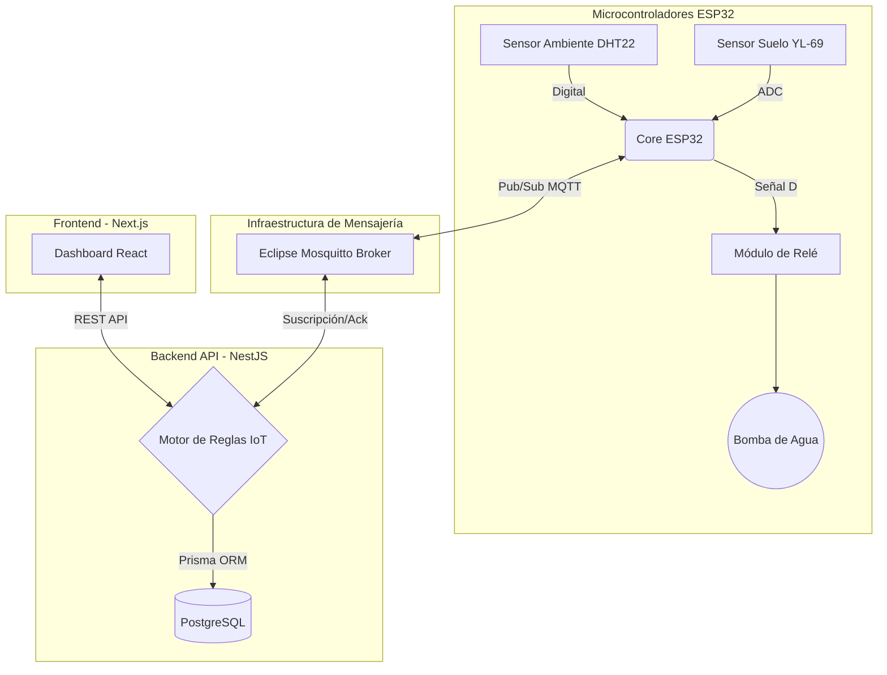

# FloraSense - Smart Irrigation IoT Fullstack 🌿💧


**FloraSense** es una plataforma profesional de grado industrial para la monitorización ambiental y el control autónomo de sistemas de riego. Conecta microcontroladores físicos con una interfaz web reactiva en tiempo real utilizando el protocolo MQTT y una arquitectura de microservicios.

---

## ✨ Características Principales

*   **Telemetría en Tiempo Real:** Monitorización de temperatura, humedad del aire y nivel de humedad del suelo con latencia inferior a 100ms vía WebSockets/MQTT.
*   **Motor de Reglas Autónomo (Edge/Cloud):** Sistema de riego que evalúa umbrales dinámicos (inicio/parada) y aplica tiempos de descanso y cortafuegos de seguridad anti-inundación.
*   **Trazabilidad y Auditoría:** Registro inmutable de cada ciclo de riego (`IrrigationEvents`) con identificación del responsable (sistema automatizado o usuario manual) y medición exacta de duración.
*   **Arquitectura Desacoplada (Monorepo Turborepo):** Separación estricta entre capa de presentación (Frontend React), lógica de negocio (Backend API REST) y firmware de bajo nivel (C++).
*   **Despliegue Contenerizado:** Infraestructura "plug-and-play" orquestada 100% con Docker Compose (Base de datos, Broker de mensajería y Servicios Web).

---

## 🏗️ Arquitectura del Sistema



---

## 📂 Estructura del Repositorio

El proyecto está estructurado como un monorepo utilizando Turborepo para maximizar el reuso de código y la velocidad de compilación.

```text
FloraSense-IoT/
├── apps/
│   ├── web/                # Aplicación Frontend (Next.js 14, TailwindCSS, Recharts)
│   └── api/                # Servidor Backend (NestJS, REST endpoints, Lógica MQTT)
│       └── prisma/         # Esquema de base de datos PostgreSQL
├── firmware/
│   ├── esp32/              # Código fuente nativo (C/C++) para hardware real
│   └── simulator/          # Hardware simulado en NodeJS para testing de estrés
├── packages/
│   ├── shared/             # Modelos de datos y schemas validados compartidos
│   └── config/             # Reglas estrictas de TypeScript y ESLint globales
└── docker-compose.yml      # Definición de la topología de contenedores
```

---

## 🚀 Entorno de Desarrollo Local

### Prerrequisitos
*   [Docker](https://www.docker.com/) y Docker Compose instalados.
*   [Node.js](https://nodejs.org/) (Versión 18 o superior).

### Inicialización Rápida (Quickstart)

1.  **Clonar el repositorio:**
    ```bash
    git clone https://github.com/tu-usuario/FloraSense-IoT.git
    cd FloraSense-IoT
    ```

2.  **Configurar Variables de Entorno:**
    Duplica el archivo de ejemplo para establecer contraseñas y puertos locales.
    ```bash
    cp .env.example .env
    ```

3.  **Levantar el Clúster de Infraestructura (Base de datos y MQTT Broker):**
    ```bash
    docker-compose up -d db mosquitto
    ```

4.  **Instalar dependencias globales del Monorepo:**
    ```bash
    npm install
    ```

5.  **Iniciar los microservicios en modo desarrollo:**
    ```bash
    npm run dev
    ```
    > El panel web estará disponible en `http://localhost:3000` y la API en `http://localhost:3001`.

---

## 🛠️ Lista de Materiales de Hardware (BOM)

Para replicar el sistema físico, se requiere el siguiente equipamiento electrónico estándar:

| Componente | Función Principal | Cantidad |
| :--- | :--- | :---: |
| **ESP32 NodeMCU** | Cerebro con conectividad WiFi 2.4GHz nativa. | 1 |
| **DHT22 / AM2302** | Termohigrómetro de precisión para el ambiente. | 1 |
| **YL-69 + YL-38** | Sonda resistiva/capacitiva anticorrosión para suelo. | 1 |
| **Módulo Relé (5V)** | Interruptor electromagnético para control de la bomba. | 1 |
| **Micro-bomba sumergible** | Actuador hidráulico de 5V - 12V DC. | 1 |

---

## 📄 Licencia

Este proyecto está bajo la Licencia **MIT**. Consulta el archivo `LICENSE` para más detalles. Siéntete libre de utilizarlo para uso personal, granjas hidropónicas comerciales o invernaderos inteligentes.
