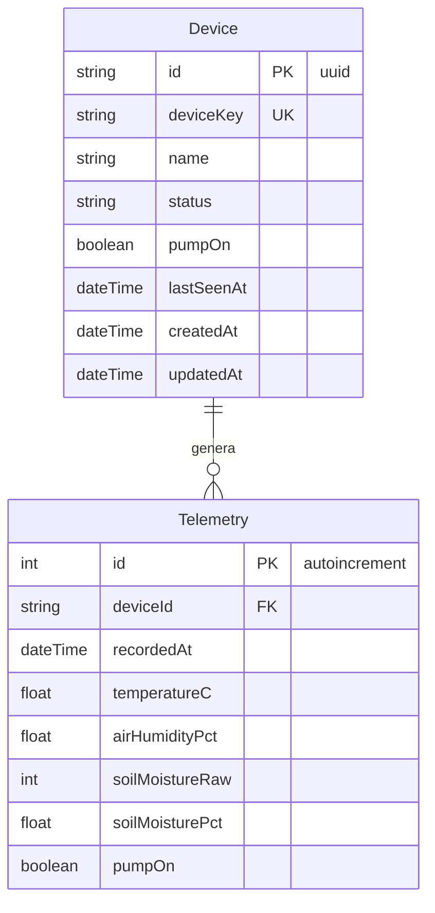

# Diagrama de Entidad-Relación (Base de Datos MySQL)

Este archivo contiene la representación visual de la base de datos MySQL para la versión simplificada del proyecto.
Puedes visualizarlo directamente en GitHub o usando una extensión de Markdown.

