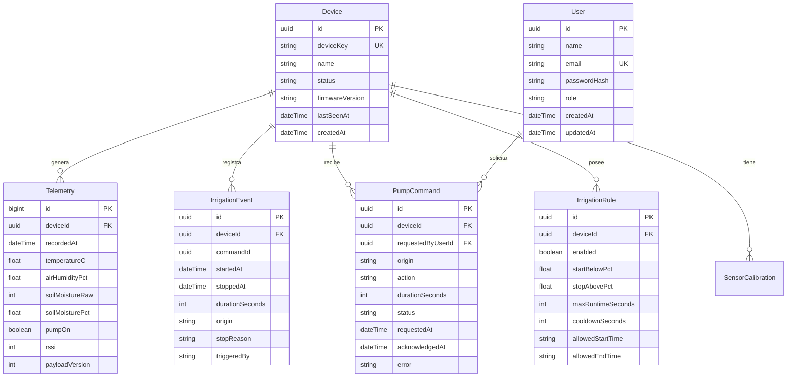

# Diagrama de Entidad-Relación (Base de Datos)

Este archivo contiene la representación visual de la base de datos PostgreSQL actual.
Puedes visualizarlo directamente en GitHub o usando una extensión de Markdown en VSCode.

